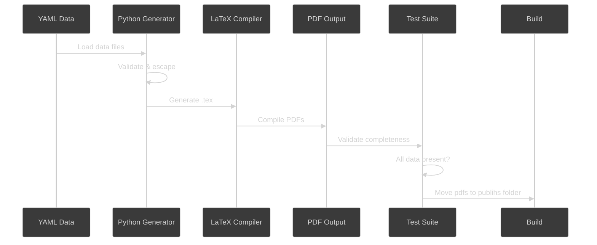

```mermaid
%%{init: {"theme": "dark", "themeVariables": {"darkMode": true, "background": "#2b2b2b", "mainBkg": "#3a3a3a", "secondBkg": "#4a4a4a"}}}%%
graph LR
    A[AI] -->|❌ Wrong| B[Complete CV]
    A -->|✓ Right| C[YAML Data]
    C --> D[Your Pipeline]
    D --> E[Professional CV]
    E --> F[Publish and Share]

    style B fill:#4a3a4a,stroke:#e599f7,stroke-width:2px
    style F fill:#3a4a3a,stroke:#94d82d,stroke-width:2px
```

# Overview

Automated CV generation pipeline that creates multiple psychologically-optimized CV variants from YAML data.

## Why This Approach?

**The AI Trap**: Most people use AI wrong for CVs

<!-- TASK: Extend this -->



**The Right Approach:**

- AI writes structured data (YAML facts)
- YOU control the pipeline and output
- Consistent quality across all variants
- Version controlled career narrative
- Update once → all CVs updated automatically

- [ ] Task -> 🗒️ restructure headers

## Quick Start

### 2. Edit Your Data

Update the YAML files in `data/` with your information:

```bash
# Edit your personal info
vim data/personal.yaml

# Edit your work experience
vim data/experience.yaml

# Edit skills, education, certifications, strengths, section titles
vim data/skills.yaml data/education.yaml data/certifications.yaml data/strengths.yaml, data/section_titles.yaml
```

- [ ] Task -> 🗒️ consider removing this logice

### 4. Get Your CVs

GitHub Actions will automatically:

- Generate 3 CV variants
- Run tests to verify all data is included
- Create a release with PDF downloads

Download from: `https://github.com/YOUR_USERNAME/YOUR_REPO/releases/latest`

## Data Structure

### personal.yaml

Basic contact information and taglines for each variant:

```yaml
first_name: "John"
last_name: "Doe"
email: "john.doe@example.com"
linkedin: "https://linkedin.com/in/johndoe"
github: "https://github.com/johndoe"
taglines:
  engineering-manager: "Engineering Manager"
  developer-advocate: "Developer Advocate"
  platform-engineer: "Senior Platform Engineer"
```

### experience.yaml

Work experience with tags for filtering:

```yaml
- title: "Senior Platform Engineer"
  company: "Tech Corp Inc"
  location: "Remote"
  start_date: "01/2022"
  end_date: "present"
  tags: ["technical", "platform", "leadership"] # Used for filtering!
  achievements:
    - "Led development of microservices architecture"
    - "Improved deployment efficiency by 60%"
```

### Other files

- `skills.yaml` - Programming languages, tools, cloud platforms
- `education.yaml` - Degrees and institutions
- `certifications.yaml` - Professional certifications with tags
- `strengths.yaml` - Key strengths with descriptions and tags
- `section_titles.yaml` - Rename Sections in the resume

## Customization

### Add New Variants

1. Create template directory: `templates/new-variant/`
2. Add template file: `templates/new-variant/template.tex.j2`
3. Add tagline to `data/personal.yaml`
4. Tag relevant experience in `data/experience.yaml`
5. Update `Makefile` VARIANTS list
6. Update `.github/workflows/cv-build.yml` matrix

### Modify Colors/Design

Edit templates in `templates/*/template.tex.j2` - each uses AltaCV LaTeX class with customizable colors.

**Current color schemes** (based on color psychology research):

- **Software Developer**: Purple (#7C3AED) - Innovation, creativity, problem-solving
- **DevOps Engineer**: Orange (#FF6B35) - Energy, collaboration, developer enablement
- **Cloud Engineer**: Steel Blue (#4682B4) - Trust, reliability, professionalism

- [ ] Task -> 🗒️ rewrite this

## Testing Locally

```bash
# Install dependencies
pip install PyYAML

# Build all CVs
make all

# Run tests
make test

# View PDFs
ls output/generated/*.pdf

# Prepare ./publish folder to be published
make build

# Publish to github pages via ./github/workflows/publish
## Ensure 1. gh is installed locally sudo apt install gh
## 2. You are logged in; gh auth login
## 3. github pages is enabled on the repo
make publish
```

<details>
<summary>ATS Versions</summary>
For online job applications, generate plain text versions optimized for Applicant Tracking Systems:

```bash
# Generate all ATS versions
python3 scripts/generate_ats.py --variant software-developer --data-dir data/ --output output/ats/software-developer.txt
python3 scripts/generate_ats.py --variant devops-engineer --data-dir data/ --output output/ats/devops-engineer.txt
python3 scripts/generate_ats.py --variant cloud-engineer --data-dir data/ --output output/ats/cloud-engineer.txt

# View generated text files
ls output/ats/*.txt
```

</details>

## Requirements

- Python 3.11+
- TeX Live (pdflatex)

- texlive-full
- texlive-latex-extra
- texlive-fonts-extra
- poppler-utils (pdftotext, pdfinfo)

- gh (optional for publishing from local)

- [ ] Task -> 🗒️ update

## How It Works



**Key Steps:**

1. Load YAML data from `data/` directory
2. Python validates and escapes special characters
3. Direct Python string building generates LaTeX (no templates)
4. LaTeX compiler creates professional PDFs
5. Test suite verifies 100% data completeness
6. GitHub Actions automates entire workflow

## Troubleshooting

### PDFs not generating locally?

Check dependencies:

```bash
# Python packages
pip list | grep PyYAML

# LaTeX
pdflatex --version

# PDF utilities
pdftotext -v
```

### Tests failing?

Run verbose test output:

```bash
python scripts/test_data_completeness.py
```

Common issues:

- Missing data in YAML files
- Special characters in LaTeX (use `\&` for `&`, `\%` for `%`)
- Tags not matching template filters

### GitHub Actions failing?

Check:

1. YAML syntax is valid
2. No special characters breaking LaTeX compilation
3. All required files present in repository

## License

MIT - Use this template freely for your own CV!
